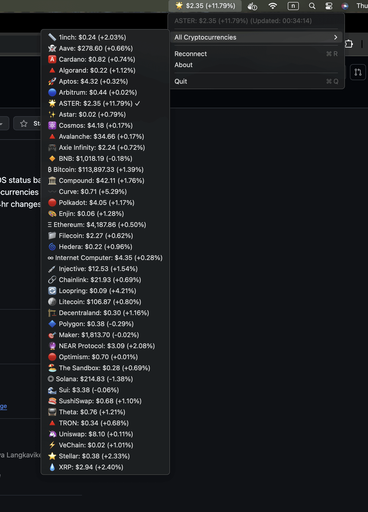

# 🪙 Bitcoin Price Tracker

A beautiful macOS application that displays real-time Bitcoin price in your status bar.

## 🖼️ Screenshot



## ✨ Features

- **🔴 Real-time price updates** - Live BTC/USDT prices from Binance
- **⚡ WebSocket connection** - Ultra-fast price updates
- **🔄 Auto-reconnection** - Never miss a price change
- **🎨 Clean interface** - Minimal and elegant design
- **🕐 Last update time** - Know when data was refreshed
- **💰 Formatted prices** - Easy-to-read currency formatting

## 📋 Requirements

- **macOS 13.0+** (Ventura or later)
- **Internet connection** for live price data
- **~5MB disk space**

## 🚀 Quick Start

### Option 1: Download Ready-to-Use App
1. Download the latest release from GitHub
2. Unzip the file
3. Right-click on "Bitcoin Price Tracker.app" → "Open"
4. Enjoy live Bitcoin prices in your status bar!

### Option 2: Build from Source
1. Clone this repository
2. Open `BitcoinPriceStatusBar.xcodeproj` in Xcode
3. Select your development team
4. Press ⌘+R to build and run

## 🔨 Building for Distribution

```bash
# Run the build script
./build.sh

# Your app will be in the 'dist' folder
```

## How to Use

1. Launch the app
2. The Bitcoin symbol (₿) with the current price will appear in your status bar
3. Click on the status bar item to see the menu with options:
   - View current BTC/USDT price with last update time
   - Reconnect (if connection issues)
   - About
   - Quit

## API

This app uses the **Binance WebSocket API** for real-time BTC/USDT price updates:
- Endpoint: `wss://stream.binance.com:9443/ws/btcusdt@ticker`
- No API key required
- Automatic reconnection on connection loss

## License

MIT License
